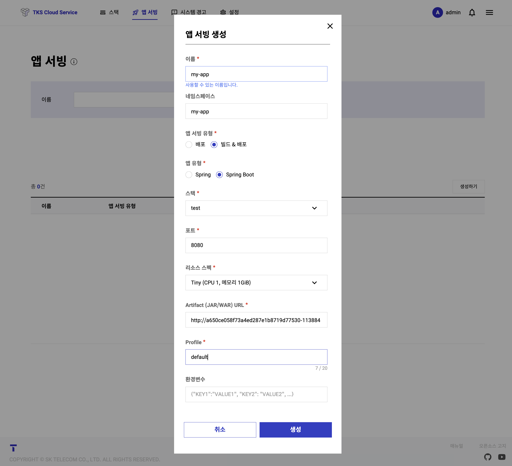
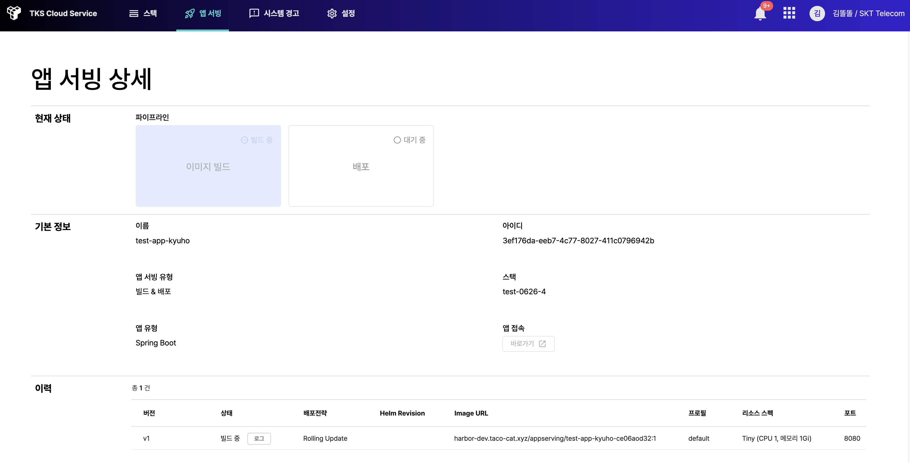
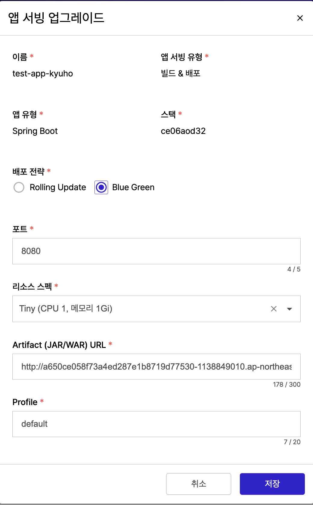
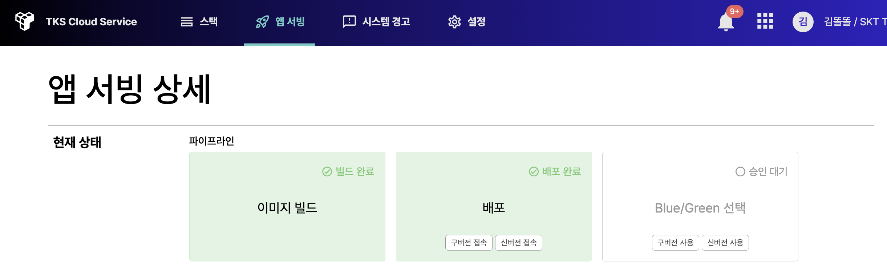
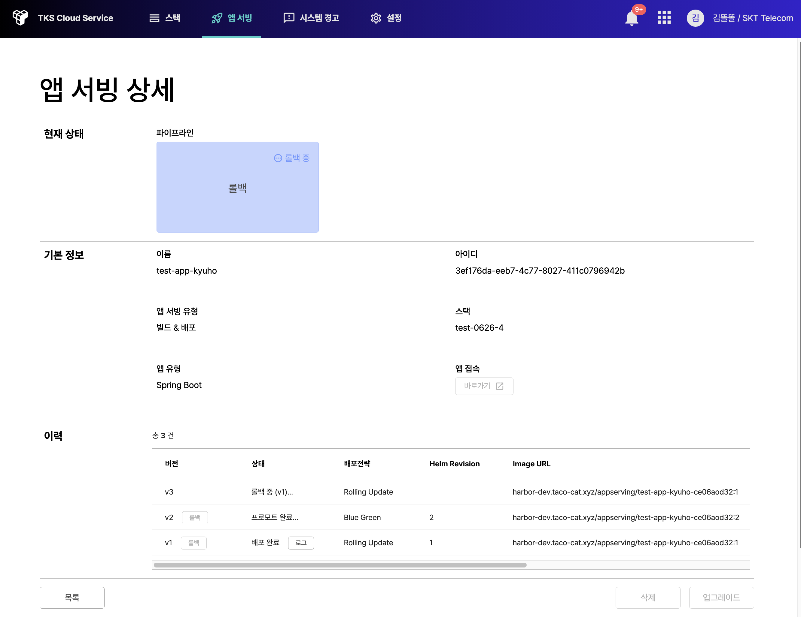

# TKS 퀵스타트 (앱서빙)

## **앱서빙생성 및 변경**
   앱서빙은 기존 Legacy SW를 쉽고 빠르게 Kuberentes에 배포하기 위한 Tool 이다.
   Legacy SW를 Kubernetes에 배포하기 위해서는 크게 아래와 같은 작업이 필요 하다.
   
   1. Legacy SW를 Container로 만들기
   2. Kubernetes Resoruce로 Container 추상화 하기
   3. 외부에 서비스 노출하기
   
   언뜻 보면, 매우 간단한 일로 보이지만, Docker로 대표되는 container eco system에 대한 이해와 Kubernetes가 지향하는 서비스 프레임워크에 대한 이해가 필요하다. 이런식의 지식은 쉽게 교과서적으로 배우기 어렵기 때문에, 초보자들이 손쉽게 접근하기 쉽지 않다.

   따라서 TKS는 기본 Legacy SW를 그동안 SKT가 보유한 노하우 기반, 자동으로 표준화된 형태로 Lift & Shift 해 줄 수 있는 Tool로 앱서빙을 제안한다.
   앱서빙이 지원하는 Legacy SW는 Spring과 Spring Boot 두 가지를 지원한다. 이는 국내 Legacy Project의 대부분이 이 두가지 Framework을 사용하고 있기 떄문이다. 또한 앱서빙은 단순히 배포뿐 아니라 배포된 앱의 업그레이드를 지원한다.
   
   - **앱 배포**

     처음 상단 매뉴의 앱서빙 매뉴로 들어가 생성  버튼을 누르면 아래와 같은 화면이 나온다.
     

     앱 서빙 유형은 앱서빙이 자동화 하는 수준이다. 어떤 Project의 경우 보안툴 설치등의 이유로 빌드 자체 파이프라인을 별도로 유지하는 경우가 있다. 따라서 빌드 없이 배포만 하는 옵션을 제공한다.
   
     포트와 프로파일은 container 에 대한 설정으로 현쟈는 각 8080과 Default만 지원한다. 리소스 스펙은 Kubernetes의 pod spec 이다.
     Spring이나 Spring Boot는 결국 Jar나 War file로 묶여서 최종적으로 Deliver됨으로 인자로 Jar/War file이 위차한 URL를 받는다.

     아래 그림은 Spring SW를 최초 빌드&배포롤 함께 하는 예제다. 현재상태 영역에서 진행 상태를 확인할 수 있다.
     

      배포가 완료되면 v1 로 배포 이력이 관리되며, 배포된 앱으로 바로 접속할 수 있는 endpoint가 제공된다. 아래는 배포 완료된 화면이다.

      아래 그림은 예제에서 설치된 앱 화면이다. (react로 개발되었다)

      

   - **앱 업그레이드**

       원하는 앱서빙 상세 화면에 들어가서 업그레이드 번튼을 누른다. 업그레이드 부터는 배로전략을 선택할 수 있다. 따라서 업그레이드할 Artificat이 저장된 URL를 선택하고 배포전략을 선택하여 업그레드 절차를 수행한다. 자습서에서는 Blue/Grean 정책을 적용했다.

       

       업그레이드 완료되면 아래 화면과 같이 이전버전과 신규버전을 서로 비교 할 수 있는 서비스 URL이 제공된다. 따라서 결과물을 보고 판단 후 프로모션(업그레이드 여부)를 실시 할 수 있다.

       

       신버전 선택 후, 연결된 앱 URL에 접속하니 Vue를 사용한 신규 서비스가 업데이트 되었다.

      

   - **앱 롤백**

      서비스를 막상 업그레이드 하고 보니, 나중에 문제가 발생하여 이전 버전으로 롤백을 할 경우가 발생 할 수 있다.

      앱서빙은 자체적으로 배포 이력을 관리하면, 롤백 기능을 제공한다. 앱서빙 상세 화면 하단의 배포 히스토리에 롤백 버튼이 생성되어 있다. 따라서 언젠던지 원하는 시점을 롤백 가능하다.

      아래는 롤백이 진행되는 화면이다.

      