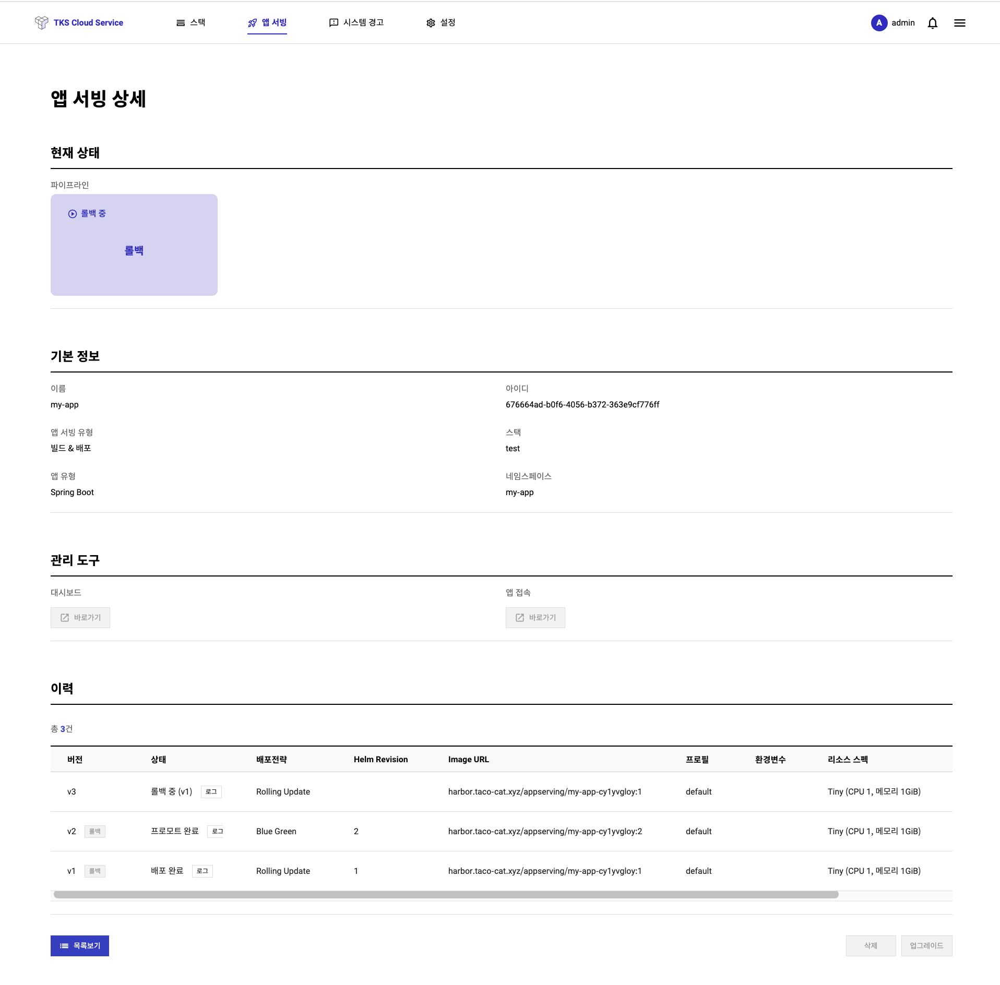

# TKS 퀵스타트 (앱서빙)

   앱서빙은 기존의 Legacy SW를 포함한 SW들을 쉽고 빠르게 Kuberentes에 배포하기 위한 서비스입니다.
   이러한 SW들을 Kubernetes에 배포하기 위해서는 크게 아래와 같은 작업이 필요 합니다.
   
   1. 개발된 SW를 Container로 빌드하기
   2. 빌드된 Container를 Kubernetes Resoruce로 추상화하기
   3. 배포된 앱을 외부에 서비스로 노출하기
   
   이 세가지 작업은 매우 간단한 절차처럼 보이지만, 실제 적용하기 위해서는 Container Eco System에 대한 이해와 Kubernetes가 지향하는 서비스 프레임워크에 대한 이해를 필요로 합니다. 이러한 지식은 쉽게 교과서적으로 배우기 어렵기 때문에, 처음 접하는 분들은 손쉽게 접근하기 어렵습니다.

   따라서 TKS는 그동안 SKT가 축적한 노하우에 기반하여, 개발된 SW를 자동으로 표준화된 형태로 Lift & Shift 해 줄 수 있는 서비스로서 앱서빙을 제안드립니다.
   현재 앱서빙은 Spring과 Spring Boot framework로 개발된 Java 앱을 지원합니다. 이는 국내에서 진행되는 Project의 대부분이 이 두가지 framework을 사용하고 있기 떄문입니다. 또한 앱서빙은 단순히 배포뿐 아니라 배포된 앱의 업그레이드 및 롤백 등 다양한 편의 기능을 지원합니다.
   
## **앱 배포**

   처음 상단 매뉴의 앱서빙 매뉴로 들어가 생성  버튼을 누르면 아래와 같은 화면이 나옵니다.
     

   - 앱 서빙 유형은 앱서빙이 자동화하는 수준입니다. 어떤 Project의 경우 보안툴 설치등의 이유로 빌드 파이프라인을 자체적으로 별도로 유지하는 경우가 있습니다. 따라서 빌드 없이 배포만 하는 옵션을 제공합니다.
   - 포트와 프로파일은 container 에 대한 설정으로, 포트는 개발된 앱이 실제로 listen하는 포트이며, 프로파일은 Spring/Spring Boot에서 사용되는 프로파일을 말합니다.
   - 리소스 스펙은 Kubernetes의 pod 가 사용할 CPU/메모리 등의 spec 입니다.
   - Spring이나 Spring Boot는 결국 Jar나 War file로 묶여서 최종적으로 배포되므로 인자로 Jar/War file이 위차한 URL를 받습니다.  
  
   아래 그림은 Spring Boot SW를 최초로 빌드&배포를 수행하는 예제이며, 현재상태 영역에서 진행 상태를 확인할 수 있습니다.
     

   배포가 완료되면 v1 으로 배포 이력이 관리되며, 배포된 앱으로 바로 접속할 수 있는 endpoint가 제공됩니다. 아래는 배포 완료된 화면입니다. (react를 사용하여 개발된 샘플입니다.)

     
   
## **앱 업그레이드**

   원하는 앱서빙 상세 화면에 들어가서 업그레이드 버튼을 누릅니다. 업그레이드부터는 배포전략을 선택할 수 있습니다. Artificat URL를 포함하여 변경할 항목을 입력하고 배포전략을 선택하여 업그레이드 절차를 수행합니다. 자습서에서는 Blue/Grean 정책을 적용했습니다.

     
  
   업그레이드가 완료되면 아래 화면과 같이 이전버전과 신규버전을 서로 비교할 수 있는 서비스 URL이 제공됩니다. 따라서 결과물을 보고 판단 후 프로모션(신규 버전 사용) 또는 abort(이전 버전 사용)를 실시 할 수 있습니다.

     
  
   신버전 선택 후, 연결된 앱 URL에 접속하니 Vue를 사용한 신규 서비스가 업데이트 되었습니다.

     
  
## **앱 롤백**

   서비스를 막상 업그레이드하고 보니, 나중에 문제가 발생하여 이전 버전으로 롤백을 해야할 경우가 발생할 수 있습니다.

   앱서빙은 자체적으로 배포 이력을 관리하므로, 언제든 원하는 시점으로 롤백 기능을 제공합니다. 앱서빙 상세 화면 하단의 배포 히스토리에 현재까지 배포된 버전들이 나열되어있고, 원하는 버전 항목의 롤백 버튼을 클릭하면 해당 버전으로 롤백을 수행하게 됩니다.

   아래는 롤백이 진행되는 화면입니다.

   

!!! tip "설정에 대한 질문이 있으시거나 도움이 필요하시면 TKS 서비스 데스크 이메일 (<sktcloudservice@sktelecom.com>) 로 언제든지 문의를 주시기 바랍니다."
