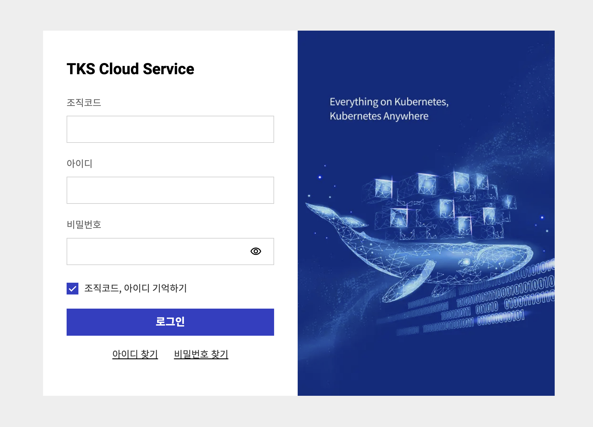
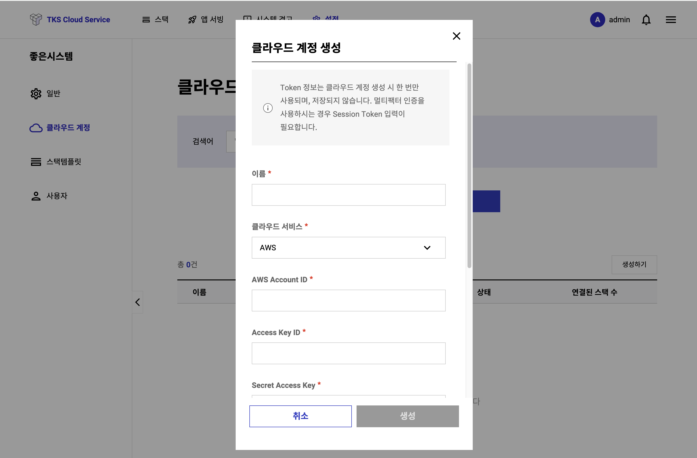

# TKS 퀵스타트 (로그인과 초기설정)
## **로그인**

TKS Console ([https://tks-console.sktelecom.com](https://tks-console.sktelecom.com))에 접근하시면, 아래와 같은 로그인창이 나옵니다.

TKS 서비스 신청 완료시 조직 생성 안내 이메일이 발송됩니다. 이메일에 표시된 **조직코드**, **아이디**, **임시비밀번호**을 사용하여 로그인 해주세요.

!!! info "최초 접속시에, 가이드에 따라서 임시 비밀번호를 변경하여 사용하시기 바랍니다."

??? note "[참고] 처음 로그인 하시면 다음과 같은 화면이 표시됩니다."
    

---
## **클라우드 계정 생성**
   
TKS는 AWS상에 손쉽게 Kubernetes Cluster 및 플랫폼 운영, 앱배포/관리등에 필요한 Tool들을 한번에 자동으로 설치하고 관리해 줍니다.

- TKS는 Kubernetes Cluster + 필요 Tool들을 합쳐서 **스택** 이라 부릅니다.
- **스택**을 사용하기 하기 위해서는 이를 설치할 클라우드를 지정해야 합니다.
- 대상 클라우드를 지정하고 TKS가 관리하기 위한 Assume Role를 생성하는 과정을 **클라우드 계정 생성** 이라고 합니다.

클라우드 계정 관리는 상단 매뉴 ==설정== 을 통해 접근 가능합니다.
처음 클라우드 계정을 생성하는 경우, 아래 그림과 같은 화면이 나옵니다.

클라우드 계정 생성하기를 누르면, 아래와 같은 화면이 나옵니다.
사전준비에서 마련해 놓은 AWS 정보를 넣고 저장하면, **클라우드계정**이 생성됩니다.

!!! Success "**==TKS는 ^^Access Key를 저장하지 않습니다^^. AWS Assume Role를 사용하여, 고객의 비밀정보를 저장하지 않고 최소한의 필요 권한을 위임 받아 동작합니다.==**"

!!! info "AWS Assume role에 대한 자세한 설명은 [AWS IAM 문서](https://docs.aws.amazon.com/IAM/latest/UserGuide/id_roles_use.html)를 참조 하세요."

Session Token의 경우 MFA가 적용된 경우 추가로 입력해 하는 값 입니다.

!!! info "최근 보안을 위해서 MFA(Multi-Factor Authentication) 사용을 권고합니다. 만약 MFA가 적용된 IAM User가 만든 AWS Access Key를 사용할 경우, Session Token을 추가로 입력해야 합니다. Session Token은 AWS CLI로 생성 할 수 있습니다. 자세한 사항은 [AWS MFA 문서](https://repost.aws/knowledge-center/authenticate-mfa-cli)를 참고하십시요."

!!! tip "설정에 대한 질문이 있으시거나 도움이 필요하시면 TKS 서비스 데스크 이메일 (<sktcloudservice@sktelecom.com>) 로 언제든지 문의를 주시기 바랍니다."