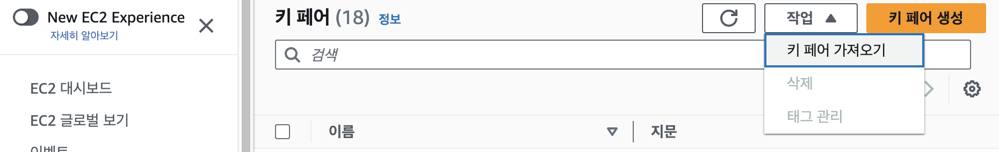
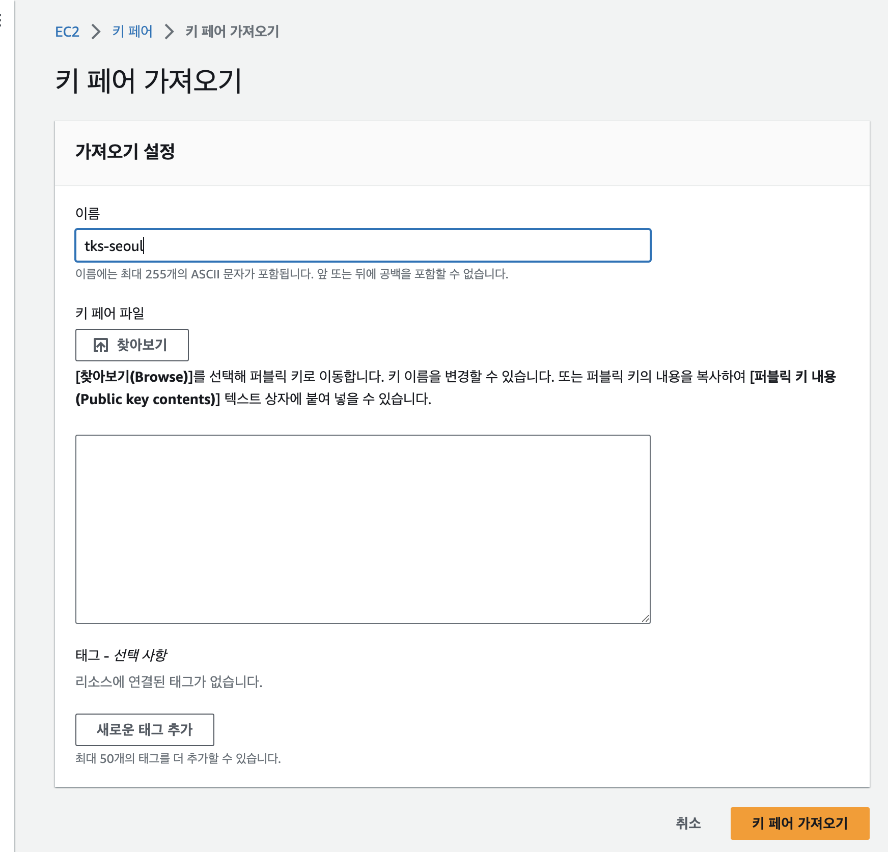

# TKS 퀵스타트 (사전 준비사항)
---

본 문서는 TKS 클라우드 서비스 (이하 TKS) 를 처음 접하는 사용자가 혼자서 쉽게 서비스를 활용 할 수 있도록 하기 위한 문서입니다. 

TKS는 전문 지식 없이도 손쉽게 쿠버네티스(Kubernetes)를 활용하고 사용자의 소프트웨어를 Kubernetes 기반으로 배포/운영할 수 있는 간편 서비스를 제공합니다.

**AWS상에서 TKS를 사용하기 위해서는 아래와 같은 사전 준비가 필요합니다.**

!!! info "**본 문서는 AWS 기준으로 기술되어 있습니다.**"
## **TKS 클라우드 서비스 신청**

TKS 클라우드 서비스는 영업 담당자를 통해서 서비스 신청과 사용 계약이 이루어집니다.
     
  - TKS에 관심 있으신 분들은 SK텔레콤의 영업담당자에게 이메일 (<sktcloudservice@sktelecom.com>) 로 문의를 주시기 바랍니다.
  - 서비스 사용 계약이 완료되면, 전달 주신 이메일로 사용하실 조직코드와 임시 비밀번호가 전달되며 [TKS 웹콘솔](https://tks-console.sktenterprise.com) 을 통해 서비스 접속이 가능해집니다.
  > 조직코드: TKS에서 고객별로 부여되는 아이디 입니다

## **AWS Access Key ID and Secret Access Key 생성**
> AWS Acccount 신청은 [AWS 홈페이지](https://aws.amazon.com/ko/?nc2=h_lg) 에 접속하여 신청 하시거나, [SK텔레콤의 Enterprise 홈페이지](https://www.sktenterprise.com/product/detail/235)를 통해 문의 주시면 됩니다.

TKS는 AWS 자원 생성 및 관리를 위해 고객의 AWS Access Key를 활용하여 AWS Assume Role 을 생성하여 사용합니다.

- Assume Role은 AWS가 제공하는 일시적인 자격 증명 수단으로 고객의 키를 저장하지 않고 사용 가능한 보안성이 우수한 방식입니다.
- Secret Access Key는 생성 후, 한번만 노출됨으로 잘 저장하여 관리 해 주세요.   
  
    
!!! note "손쉬운 시작을 위해, 아래와 같이 Admin Access 권한을 갖는 Access Key를 사용하는 방법으로 설명드립니다."
    - 사내 보안 정책에 따라 보다 제한된 정책만 적용 하여 설치 가능합니다. 자세한 가이드는 <tks-service@sktelecom.com>으로 문의 부탁드립니다.   
    - AWS access key ID / secret access key에 대한 자세한 정보 및 생성 방법은 아래 AWS 문서를 참고해 주세요. ([AWS Account and Access Keys Guide](https://docs.aws.amazon.com/powershell/latest/userguide/pstools-appendix-sign-up.html))

1. **AWS Console로 접근 후, IAM User를 생성합니다.**    
2. **생성된 IAM User에 AdminstratorAccess 정책을 부여합니다.**
     
3. **IAM User의 Access key 를 생성합니다.**
       
## **EC2 SSH연결에 사용할 인증서 설정**

> AWS EC2 생성 시, SSH연결을 위한 인증서가 필요합니다. Host 접근이 필요한 경우를 대비, 미리 SSH 인증서를 등록합니다.   
    
1. EC2 Memual의 키페어 매뉴에 들어가 **작업 --> 키 페어 가저오기** 를 선택합니다.
   
2. 아래와 같이 사용할 public key를 등록하여 AWS가 안전하게 pem key를 생성하여 관리하게 합니다.
!!! warning "인증서 이름은 **반드시** **==tks-seoul==** 로 설정 해주시기 바랍니다."
   

!!! tip "설정에 대한 질문이 있으시거나 도움이 필요하시면 TKS 서비스 데스크 이메일 (<sktcloudservice@sktelecom.com>) 로 언제든지 문의를 주시기 바랍니다."
