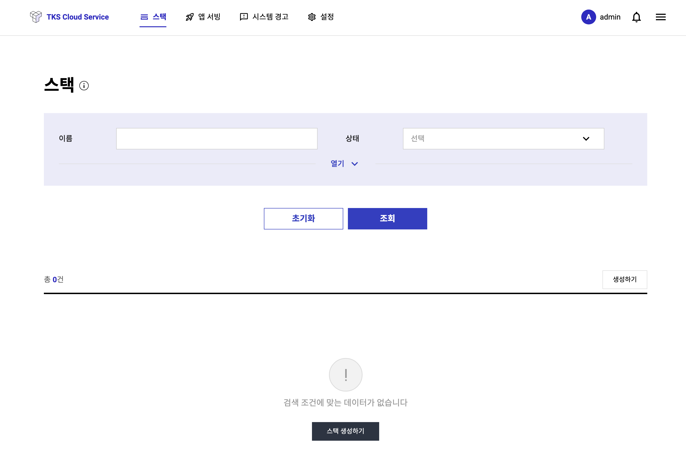
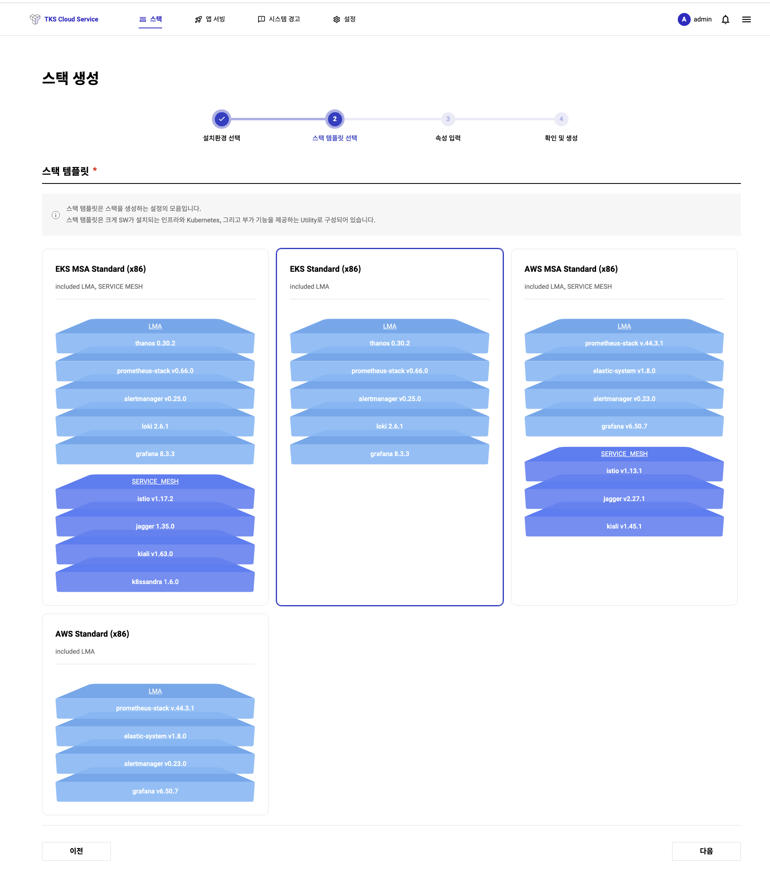

# TKS 퀵스타트 (스택)

## **스택 생성**

스택생성을 위해서는 상단메뉴 **==스택==** 을 선택하여, 스택관리 화면으로 들어 갑니다. (아래 화면 참조)



위 화면에서 **==스택 생성하기==** 버튼을 누르면 스택 생성 화면이 표시됩니다. 스택 생성 화면의 입력창에 아래와 같은 정보를 입력합니다.

!!! info "스택 생성 절차" 
    1. 이름 : 스택의 이름을 입력합니다.
    2. 클라우드계정 : 앞서 만든 클라우드계정을 선택합니다.
    3. 스택 템플릿 : 스택 템플릿은 스택의 종류입니다. 원하는 스택의 종류를 선택합니다.
        - 현재(2023년 7월) 2개의 스택 템플릿을 사용하실 수 있습니다. 
            - EKS Standard(x86) : 기본 구성으로 모니터링 파이프라인 및 필요한 Add-on 이 설치되어 있습니다.
            - EKS MSA Standard(x86) : EKS Standard 구성에 Service Mesh를 사용할 수 있는 Tool이 추가 설치되어 있습니다.
    4. 인프라 노드: 인프라노드는 스택이 제공하는 기본 소프트웨어가 구동되는 노드로 현재 3개의 AZ에 걸쳐 HA 구성이 된 3개 노드를 기본적으로 제공하고 있습니다.
    5. 워커 노드: 워커노드는 사용자의 어플리케이션이 배포 되는 노드입니다. 원하는 개수의 노드를 입력합니다.
    6. 정보 입력을 마치고 **==생성==** 버튼을 누르면 스택이 생성됩니다.


**==생성==**버튼을 누른 후에는 아래와 같이 **스택 상세 조회 화면**으로 이동하며 설치 상태 영역에서 진행 상황을 확인 할 수 있습니다.



!!! tip "스택생성은 비동기로 처리됩니다. 환경에 따라 다르지만 통상 30분 이상 시간이 소요됩니다. 따라서, 상단 매뉴의 ==스택== 으로 이동되면 아래와 같이 스택의 정보를 볼 수 있습니다."
    테이블을 보면 **모니터링 유형** 항목이 있습니다. TKS는 멀티 스택에 대한 통합 모니터링 환경을 제공 합니다. 
    
    - **최초 생성된 스택**의 모니터링 유형은 자동으로 **Primary**가 됩니다.
    - Primary는 멀티 클러스터 모니터링을 위한 단일 포인트 Access(Grafana)를 제공하는 스택입니다. 
    - 이후에 생성되는 스택의 모니터링 유형은 Member 입니다.  
    
    <span style="color:red">! Primary 유형의 스택은 Member 유형의 스택을 모두 삭제 전에는 삭제될 수 없습니다.</span>   

    

## **스택 접근**

스택 생성이 완료된 후에, 아래 스택 상세화면을 통해 2가지 방법으로 접근이 가능합니다.


### **Grafana로 접근**

스택 상세 화면에서 **관리 도구** 섹션에 있는 **==운영 대시보드 바로가기==** 버튼을 클릭하여 Grafana에 접근할 수 있습니다. 

- 미리 구성된 다양한 Built-in Dashboard들을 통해 조직 내 모든 스택에 대한 모니터링을 할 수 있습니다. 
- Grafana는 TKS Console과 SSO를 지원하기 때문에, TKS Console에 로그인 후 자동 로그인 됩니다.
  


### **kubeconfig로 접근**

가장 전통적인 방법으로 CLI를 통해 접근하는 방법입니다. (e.g. kubectl get ns)
    
스택 상세 화면의 **관리 도구** 영역의 **==kubeconfig 다운로드==** 버튼을 통해 kubeconfig 파일을 다운로드 받아 kubectl tool을 이용해 접근할 수 있습니다.

단, 다음과 같은 이유로 다운로드 한 kubeconfig 파일을 활용하기 위해서는 몇 가지 추가 작업이 필요합니다.

!!! info "TKS는 AWS를 사용시 AWS STS(Security Token Service)를 활용해 Kubernetes API에 대한 보다 안전한 접근을 제공합니다."
    Kubernetes는 자체적으로 사용자 관리 기능을 제공하지 않고, 외부 서비스와 연동하게 설계되어 있습니다. 
    <br> 이는 핵심에 집중하여 본질에 충실하기 위한 Open Source의 정신에 입각한 진화 방향입니다. 
        
    따라서, 안전한 접근을 위해 AWS IAM Authenticator를 사용합니다. AWS IAM Authenticator는 AWS STS를 통해 발급받은 임시 보안 자격 증명을 사용하여 Kubernetes API에 대한 인증을 수행합니다.
        
- **AWS IAM Authenticator 설치 및 사용법**
        
    TKS가 제공하는 Kubeconfig을 사용하기 위해서는 **kubectl** tool 설정된 Host PC에 AWS IAM Authenticator를 설치해야 합니다.   

    !!! info "CLI 접근을 Host PC에 필요한 Tool은 아래와 같습니다."
        - AWS IAM Authenticator (**0.5.9 version 이상**)   
            <a href="https://docs.aws.amazon.com/ko_kr/eks/latest/userguide/install-aws-iam-authenticator.html" target="_blank"> https://docs.aws.amazon.com/ko_kr/eks/latest/userguide/install-aws-iam-authenticator.html</a>
        - kubectl: 
            <a href="https://kubernetes.io/docs/tasks/tools/" target="_blank">https://kubernetes.io/docs/tasks/tools/</a>
        - (option) AWS CLI : 설정이 잘 되었는지 확인 시 필요합니다.   
            <a href="https://docs.aws.amazon.com/cli/latest/userguide/getting-started-install.html" target="_blank">https://docs.aws.amazon.com/cli/latest/userguide/getting-started-install.html</a>

    아래는 AWS IAM User 권한으로 AWS STS를 사용하여 Kubernetes API (kubectl)를 사용하기 위한 절차입니다.
      
    1. 사용할 IAM User에 아래와 같은 정책을 추가 합니다.   
    ```
        {
             "Version": "2012-10-17",
            "Statement": [     
                {
                     "Effect": "Allow",
                    "Action": "sts:AssumeRole",
                    "Resource": "*"
                }
            ]      
        } 
    ```
    2. TKS를 관리하는 Role에 사용할 IAM User를 신뢰할 수 있있는 Entity로 추가합니다.

        TKS로 스택을 최초 생성 시, ==controllers.cluster-api-provider-aws.sigs.k8s.io== 을 생성 합니다.
        위 Role에 IAM User의 ARN을 신뢰 할 수 있는 개체로 등록합니다.
        IAM > 역활 > 신뢰관계 에서 아래와 같은 내용을 추가 합니다.
        

    3. IAM User의 AWS access Key를 생성합니다.
    4. Host PC에 AWS 환경 설정을 위해, 사용자 루트 Directory 하위 " .aws"에 설정 파일을 생성합니다.
            
        config 파일 예

        ```
            [default]
            region = ap-northeast-2
            output = json
        ```

        credential 파일 예

        ```
           [default]
           aws_access_key_id = IAM User에서 생성한 Key ID
           aws_secret_access_key = IAM User에서 생성한 Key 값
        ```

        아래 명령어를 통해, 현재 kubeconfig에서 사용할 IAM User를 확인 할 수 있습니다.

        ```
           $ aws sts get-caller-identity

           {
               "UserId": "xxxxxxxxxxxxxxxxxx"
               "Account": "123412341234",
               "Arn": "arn:aws:iam::123412341234:user/gildonghong"
           }
        ```

위와 같은 AWS IAM Authenticator를 설치 및 설정을 마치면 kubeconfig 파일을 활용하여 스택에 접근할 수 있습니다.

!!! tip "설정에 대한 질문이 있으시거나 도움이 필요하시면 TKS 서비스 데스크 이메일 (<sktcloudservice@sktelecom.com>) 로 언제든지 문의를 주시기 바랍니다."