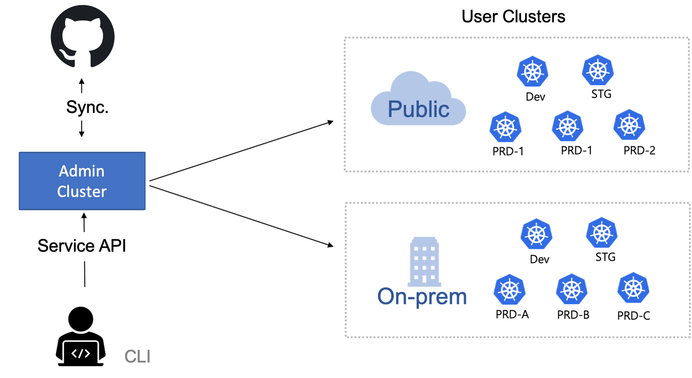

# SKT TKS

SK텔레콤은 가상화를 4G/5G에 선도적으로 적용해 왔고, 이를 위해 OpenStack과 같은 복잡한 가상황 관리 Service를 효율적으로 관리하는 기술을 꾸준히 연구해 왔다. SK Telecom은 Container 기술을 활용하여, 복잡한 SW module간 종속성 문제를 해결하고자 했다. 이러한 노력에 대한 결과물은 여러 사람들이 널리 이롭게 사용하도록 Open Source로 공개해 왔다.
가장 대표적인 Open Source는 Decapod로, Decapod는 Open Source로 구성된 복잡한 Service를 Containerization를 통해 선언적으로 관리하는 GitOps CD pipeline이다.

SKT Enterprise Kubernetes Service는 크게 두 개의 오픈소스SW 기술 (Decapod, TACO Kubernetes Service)로 구성되어 있다.

- Decapod (Declarative Application Orchestration & Delivery)
- TKS (All-in-One container Solution)

Decapod는 ... 기술로, .. 을 제공한다.

TKS는 Decapod 기술을 기반으로, Kubernetes Cluster와 Kubernetes를 운영하기 위한 Add-on (CNI, CSI, Ingress Controller등)과 서비스들(Monitoring, Service Mesh)을 All-in-One으로 제공하는 통합 컨테이너 관리 플랫폼이다.

SKT Container Platform의 주요 특징은 다음과 같다.    

- Hybrid, Multi Cloud 지원
-  All-in-One Package
- CaaS(Container as a Service)

[GitHub Page https://github.com/openinfradev/releases](https://github.com/openinfradev/releases)

